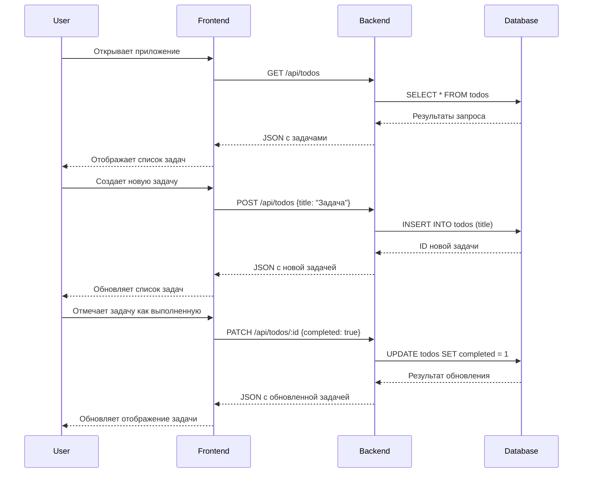

# Архитектура проекта Todo-List

## 1. Структура проекта (папки и файлы)

```
todo-list/
├── package.json           # Основной файл конфигурации проекта
├── .gitignore             # Файл для игнорирования в Git
├── README.md              # Документация проекта
├── server/                # Директория бэкенда
│   ├── index.js           # Точка входа для сервера
│   ├── db/                # Директория для работы с базой данных
│   │   ├── index.js       # Инициализация базы данных
│   │   └── schema.sql     # SQL схема базы данных
│   ├── routes/            # Маршруты API
│   │   └── todos.js       # Маршруты для работы с задачами
│   ├── controllers/       # Контроллеры для обработки запросов
│   │   └── todos.js       # Контроллер для работы с задачами
│   └── models/            # Модели данных
│       └── todo.js        # Модель для работы с задачами
├── client/                # Директория фронтенда
│   ├── index.html         # Основной HTML файл
│   ├── src/               # Исходный код React
│   │   ├── index.js       # Точка входа для React
│   │   ├── App.js         # Основной компонент приложения
│   │   ├── components/    # React компоненты
│   │   │   ├── TodoList.js       # Компонент списка задач
│   │   │   ├── TodoItem.js       # Компонент отдельной задачи
│   │   │   └── TodoForm.js       # Форма для создания задачи
│   │   └── api/           # Функции для работы с API
│   │       └── todos.js   # Функции для работы с API задач
│   └── public/            # Статические файлы
│       └── styles.css     # CSS стили
└── data/                  # Директория для хранения данных
    └── todos.db           # SQLite база данных
```

## 2. Схема базы данных

Для нашего простого todo-list приложения нам понадобится всего одна таблица:

```sql
CREATE TABLE IF NOT EXISTS todos (
  id INTEGER PRIMARY KEY AUTOINCREMENT,
  title TEXT NOT NULL,
  completed BOOLEAN DEFAULT 0,
  created_at TIMESTAMP DEFAULT CURRENT_TIMESTAMP
);
```

Поля таблицы:

- `id` - уникальный идентификатор задачи
- `title` - название/описание задачи
- `completed` - статус выполнения задачи (0 - не выполнена, 1 - выполнена)
- `created_at` - дата и время создания задачи

## 3. API эндпоинты

Для базового функционала нам понадобятся следующие API эндпоинты:

1. **GET /api/todos**

   - Описание: Получение списка всех задач
   - Параметры: нет
   - Ответ: Массив объектов задач

   ```json
   [
     {
       "id": 1,
       "title": "Купить молоко",
       "completed": false,
       "created_at": "2025-05-12T10:30:00.000Z"
     },
     ...
   ]
   ```

2. **POST /api/todos**

   - Описание: Создание новой задачи
   - Параметры тела запроса:
     ```json
     {
       "title": "Название задачи"
     }
     ```
   - Ответ: Созданный объект задачи
     ```json
     {
       "id": 1,
       "title": "Купить молоко",
       "completed": false,
       "created_at": "2025-05-12T10:30:00.000Z"
     }
     ```

3. **PATCH /api/todos/:id**
   - Описание: Обновление статуса задачи (отметка о выполнении)
   - Параметры URL: id - идентификатор задачи
   - Параметры тела запроса:
     ```json
     {
       "completed": true
     }
     ```
   - Ответ: Обновленный объект задачи
     ```json
     {
       "id": 1,
       "title": "Купить молоко",
       "completed": true,
       "created_at": "2025-05-12T10:30:00.000Z"
     }
     ```

## 4. Основные компоненты фронтенда

1. **App.js** - Основной компонент приложения

   - Содержит состояние приложения (список задач)
   - Обрабатывает основные функции (получение списка задач)

2. **TodoList.js** - Компонент списка задач

   - Отображает список всех задач
   - Передает функции для отметки задач как выполненных

3. **TodoItem.js** - Компонент отдельной задачи

   - Отображает информацию о задаче (название, статус)
   - Содержит чекбокс для отметки задачи как выполненной

4. **TodoForm.js** - Форма для создания новой задачи
   - Содержит поле ввода для названия задачи
   - Содержит кнопку для отправки формы

## 5. Взаимодействие между фронтендом и бэкендом



## 6. Технические детали реализации

### Бэкенд (Express.js + SQLite)

1. **Инициализация базы данных**

   - Использование модуля `sqlite3` для работы с SQLite
   - Создание таблицы при первом запуске приложения

2. **Middleware**

   - `express.json()` для парсинга JSON в запросах
   - CORS middleware для обработки кросс-доменных запросов

3. **Контроллеры**

   - Функции для обработки запросов к API
   - Взаимодействие с моделями для работы с данными

4. **Модели**
   - Функции для работы с базой данных
   - SQL запросы для CRUD операций

### Фронтенд (React)

1. **Состояние приложения**

   - Использование хуков React (`useState`, `useEffect`)
   - Хранение списка задач в состоянии компонента App

2. **API клиент**

   - Использование `fetch` для отправки запросов к API
   - Функции для работы с каждым эндпоинтом

3. **Компоненты**

   - Функциональные компоненты с хуками
   - Передача данных и функций через props

4. **Стилизация**
   - Простые CSS стили для базового оформления
